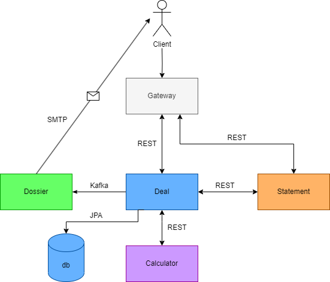
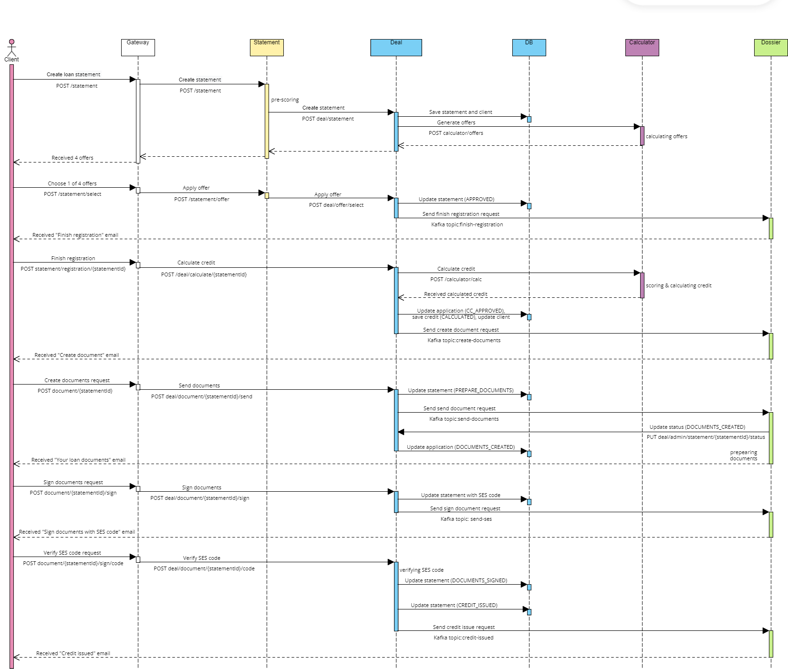
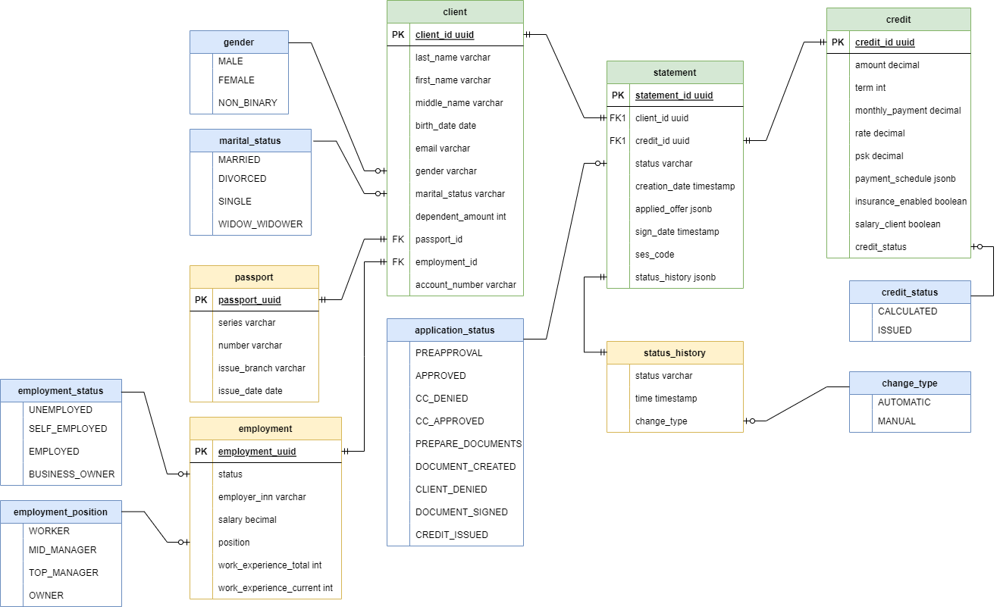

# credit-bank-application

[](https://www.oracle.com/java/)
[](https://spring.io/projects/spring-boot)
[](https://maven.apache.org/)
[](https://www.docker.com/)
[](https://kafka.apache.org/)
[](https://www.postgresql.org/)
[](https://hibernate.org/)
[](https://www.liquibase.com/)
[](https://junit.org/junit5/docs/current/user-guide/)
[](https://mapstruct.org/)
[](https://eclipse-ee4j.github.io/javamail/)
[](https://editor-next.swagger.io/)
[](https://github.com/features/actions)
[](https://projectlombok.org/)

[](https://sonarcloud.io/summary/new_code?id=twentyoneh_credit-bank-application)
[](https://codecov.io/gh/twentyoneh/credit-bank-application)


## Логика работы

1. Пользователь отправляет заявку на кредит.
2. МС Заявка осуществляет прескоринг прескорингзаявки и если прескоринг проходит, то заявка сохраняется в МС Сделка и отправляется в МС калькулятор.
3. МС Калькулятор возвращает через МС Заявку пользователю 4 предложения (сущность "LoanOffer") по кредиту с разными условиями (например без страховки, со страховкой, с зарплатным клиентом, со страховкой и зарплатным клиентом) или отказ.
4. Пользователь выбирает одно из предложений, отправляется запрос в МС Заявка, а оттуда в МС Сделка, где заявка на кредит и сам кредит сохраняются в базу.
5. МС Досье отправляет клиенту письмо с текстом "Ваша заявка предварительно одобрена, завершите оформление".
6. Клиент отправляет запрос в МС Сделка со всеми своими полными данными о работодателе и прописке.
   Происходит скоринг данных в МС Калькулятор, МС Калькулятор рассчитывает все данные по кредиту (ПСК, график платежей и тд), МС Сделка сохраняет обновленную заявку и сущность кредит сделанную на основе CreditDto полученного из КК со статусом CALCULATED в БД.
7. После валидации МС Досье отправляет письмо на почту клиенту с одобрением или отказом.
   Если кредит одобрен, то в письме присутствует ссылка на запрос "Сформировать документы"
8. Клиент отправляет запрос на формирование документов в МС Досье, МС Досье отправляет клиенту на почту документы для подписания и ссылку на запрос на согласие с условиями.
9. Клиент может отказаться от условий или согласиться.
   Если согласился - МС Досье на почту отправляет код и ссылку на подписание документов, куда клиент должен отправить полученный код в МС Сделка.
10. Если полученный код совпадает с отправленным, МС Сделка выдает кредит (меняет статус сущности "Кредит" на ISSUED, а статус заявки на CREDIT_ISSUED)

### Архитектура



### Sequence диаграмма



### Business flow


Цвета:
- Оранжевый: Application
- Голубой: Deal + Database
- Фиолетовый: Conveyor
- Зеленый: Dossier
- Красный: конец флоу

Типы действий:
- Иконка «человек» сверху слева: пользовательское действие
- Иконка «зубчатое колесо» сверху слева: действие системы
- Иконка «молния»: ошибка
- Иконка «прямоугольник с горизонтальными полосками»: выбор пользователя
- Иконка «конверт»: асинхронная отправка email-сообщения на почту

## Запуск приложения

1. Прописать логин и пароль для почты для отправки писем в файле application-dev.yml;
2. Собрать все сервисы в пакеты .jar (например, через вкладку Maven: Maven -> Lifecycle -> application -> package);
3. Для локального запуска бекенд-приложения с БД установите и откройте программу
   [Docker Desktop](https://www.docker.com/products/docker-desktop/).
   <br>Затем в командной строке cmd выполните следующие команды

```shell
   git clone https://github.com/twentyoneh/credit-bank-application.git
   cd credit-bank-application  
   mvn clean package
   git checkout main
   docker-compose up -d
   ```

4. [Swagger](http://localhost:8081/swagger-ui/index.html#/)


## Диаграмма базы данных



Цвета:
- Зеленый: сущность реализована в виде отдельного отношения.
- Желтый: сущность реализована в виде поля типа jsonb.
- Синий: сущность реализована в виде java enum, сохранена в БД как varchar.
